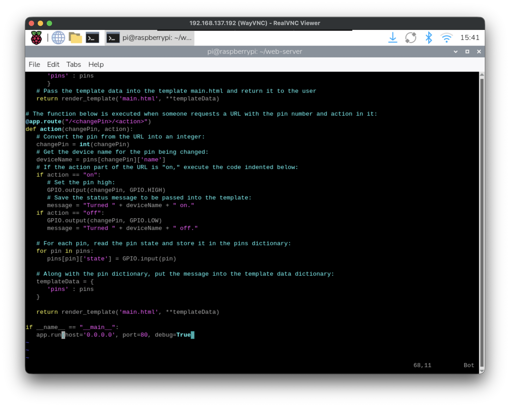
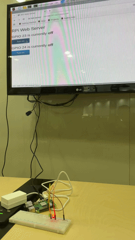

# IoT26-HW04: Raspberry Pi Web Server using Flask to Control GPIOs

## 1. Project Overview

This assignment focuses on building a standalone web server on Raspberry Pi using Flask to control GPIO outputs (LEDs) through a browser interface. By accessing the server from any device on the same network, users can toggle two LEDs connected to GPIO 23 and GPIO 24. I used the `gpiozero` library with `lgpio` backend for Raspberry Pi 5 compatibility, and verified the output through the physical LED behavior and the web interface.

## 2. Execution Screenshots

Below is the screenshot of the web interface and board setup while the server is running.



## 3. Working Video

GIF Preview:



## 4. Main Source Code

```python
from flask import Flask, render_template, abort
from gpiozero import LED, Device
from gpiozero.pins.lgpio import LGPIOFactory
import atexit

# Raspberry Pi 5 compatibility
Device.pin_factory = LGPIOFactory()

app = Flask(__name__)

leds = {
    23: LED(23),
    24: LED(24),
}

pins = {
    23: {"name": "GPIO 23", "state": 0},
    24: {"name": "GPIO 24", "state": 0},
}

def update_pin_states():
    for pin, led in leds.items():
        pins[pin]["state"] = 1 if led.is_lit else 0

@app.route("/")
def main():
    update_pin_states()
    return render_template("main.html", pins=pins)

@app.route("/<int:changePin>/<action>")
def action(changePin, action):
    if changePin not in leds:
        abort(404)
    if action == "on":
        leds[changePin].on()
    elif action == "off":
        leds[changePin].off()
    update_pin_states()
    return render_template("main.html", pins=pins)

@atexit.register
def cleanup():
    for led in leds.values():
        led.off()
        led.close()

if __name__ == "__main__":
    app.run(host="0.0.0.0", port=5000, debug=True, use_reloader=False)
```
